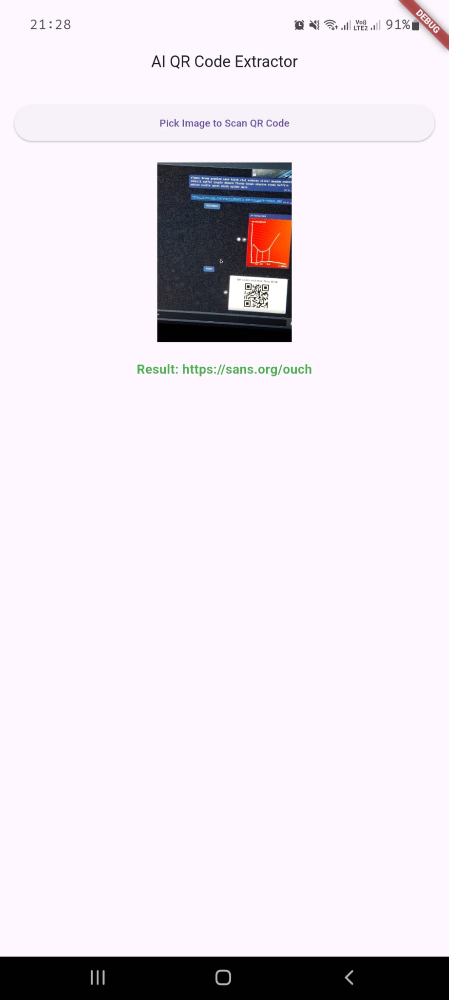

<!-- markdownlint-disable MD033 MD041 -->

# Image-Based QR Code Detection with AI/ML

**Emirhan Altunel**
**Hasan Karakuş**

---

## Introduction

### Project Overview & Motivation

- **Challenges with Standard Scanners:** Complex backgrounds, poor lighting, damage, distortion.
- **Our Approach:** AI/ML (TensorFlow Lite) to enhance robustness and accuracy.
- **Motivation:**
  - Need for reliable, versatile scanning solutions.
  - Cross-platform accessibility via Flutter.
  - Address demand for intelligent QR reading, crucial for scenarios needing quick, accurate data capture.

---

### Problem Statement

Existing QR scanning solutions struggle with:

- 🏙️ **Complex Backgrounds:** Difficulty isolating QR codes.
- 🌫️ **Poor Image Quality:** Low resolution, blur, poor lighting.

**Core Problem:** Create a system that "sees" and interprets QR codes more like a human, leveraging ML to overcome limitations of traditional algorithms.

---

## Objectives

### Primary Goals

1. **Cross-Platform App (Flutter):** For web, mobile, desktop; seamless image selection/capture.
2. **AI QR Region Detection (TFLite):** Accurate detection even with noise, complex backgrounds, minor distortions.
3. **Robust QR Decoding:** Use established Flutter plugins (e.g., `qr_code_tools`, `zxing2`).
4. **Near Real-Time Performance:** Responsive user experience.
5. **Intuitive UI:** Clear display of decoded content, user interaction options (copy, open).

---

### Key Performance Indicators (KPIs)

- 🎯 **Detection Accuracy:** >95% success in QR region detection on a diverse test dataset.
- 💡 **Decoding Success Rate:** >98% correct data decoding from successfully detected QR codes.
- ⏱️ **Processing Speed:** <500 milliseconds (average on target mobile devices).
- 💻 **Platform Compatibility:** Successful deployment on web, Android, iOS, and one desktop OS.
- 👍 **User Satisfaction:** Positive qualitative feedback on ease of use and reliability.

---

## Proposed Solution

### System Architecture Overview

1. **Flutter User Interface (UI) Layer:**
   - Image selection.
   - Displays image, initiates process.
   - Presents decoded info.
2. **AI-Based QR Detection Module (TensorFlow Lite):**
   - Identifies presence and location (bounding box) of QR codes.
   - Utilizes pre-trained TFLite object detection model.

---

### User Interaction Flow

1. **Select Image:** User chooses image from gallery/file system.
2. **Processing:**
   - Image sent to AI Detection Module (loading indicator shown).
   - AI model locates QR codes.
   - Detected region passed to QR Decoding Module.
   - Decoder interprets QR data.
3. **Display Results:**
   - **Success:** Decoded info displayed (text, URL)
   - **Failure (No QR):** "No QR code detected" message.
4. **New Scan:** User can process another image.

---

## Technological Stack

- **User Interface (Flutter):**

  - **Framework:** Flutter SDK (Dart language)
  - **Key Packages:** `image_picker`, `tflite_flutter`.

- **AI/ML for QR Code Detection (TensorFlow Lite):**

  - **Framework:** TensorFlow Lite (TFLite)
  - **Model Source:** Pre-trained (e.g., SSD MobileNet, YOLO variants from TF Hub) or custom-trained.
  - **Integration:** `tflite_flutter` plugin.

---

### UI Mockup Example

A clean interface allowing:

- Image selection button
- Image preview area
- Clear result display area
- Action buttons (e.g., Copy, Open Link)

