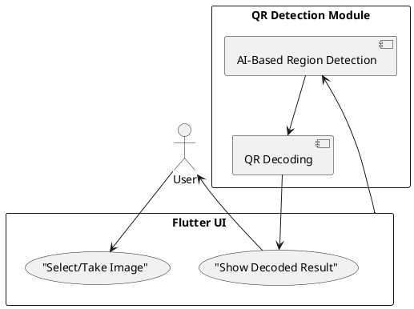

# Project Proposal: Image-Based QR Code Detection with AI/ML

> Emirhan Altunel
> Hasan Karakuş

## Introduction

This project develops an AI/ML-based app that detects and decodes QR codes from images. It's designed for mobile network applications like device provisioning or secure data transfer.

## Objectives

- Detect and decode QR codes from images using AI/ML.
- Provide a simple UI using Flutter (supporting web, mobile, desktop).
- Ensure real-time or near real-time performance.

## Technologies

- **UI**: Flutter (multi-platform)
- **QR Detection**: TensorFlow Lite model for QR region detection
- **Decoding**: Flutter plugins like `qr_code_tools`, `zxing2` for decoding detected region

## System Architecture

## Approach

To achieve the project's objectives, the following steps will be followed:

1. **Flutter UI Implementation**: Build a cross-platform interface that allows users to select or capture images using the camera or gallery.
2. **AI-Based Detection**: Integrate a TensorFlow Lite model trained to detect QR code regions in an image, especially in complex or noisy backgrounds.
3. **QR Decoding**: Use Flutter-compatible tools (`qr_code_tools`, `zxing2`, etc.) to decode the content from the detected QR region.
4. **Display Result**: Show the decoded QR content clearly on the UI, with options to copy or use the data.

This approach ensures a learning-based detection method is at the core of the project, while the rest of the system leverages the Flutter ecosystem for multi-platform support.
