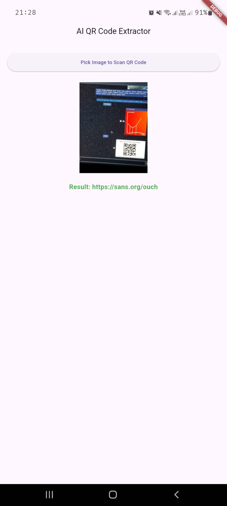

# Project Proposal: Image-Based QR Code Detection with AI/ML

Emirhan Altunel
Hasan Karakuş

<!-- markdownlint-disable-next-line -->

<!-- markdownlint-disable-next-line -->

## Table of Contents

- [Project Proposal: Image-Based QR Code Detection with AI/ML](#project-proposal-image-based-qr-code-detection-with-aiml)
  - [Table of Contents](#table-of-contents)
  - [Executive Summary](#executive-summary)
  - [Introduction](#introduction)
    - [Project Overview and Motivation](#project-overview-and-motivation)
    - [Problem Statement](#problem-statement)
  - [Objectives](#objectives)
    - [Primary Goals](#primary-goals)
    - [Key Performance Indicators](#key-performance-indicators)
  - [Proposed Solution](#proposed-solution)
    - [System Architecture Overview](#system-architecture-overview)
    - [User Interaction Flow](#user-interaction-flow)
  - [Technological Stack](#technological-stack)
    - [User Interface (Flutter)](#user-interface-flutter)
    - [AI/ML for QR Code Detection (TensorFlow Lite)](#aiml-for-qr-code-detection-tensorflow-lite)
    - [QR Code Decoding Libraries](#qr-code-decoding-libraries)
  - [Methodology and Implementation Plan](#methodology-and-implementation-plan)
    - [Flutter UI Development](#flutter-ui-development)
    - [AI-Based QR Region Detection Module](#ai-based-qr-region-detection-module)
    - [QR Code Decoding Integration](#qr-code-decoding-integration)
    - [Result Display and Interaction](#result-display-and-interaction)
  - [Expected Outcomes and Deliverables](#expected-outcomes-and-deliverables)
  - [Evaluation Plan](#evaluation-plan)
    - [Detection Accuracy Metrics](#detection-accuracy-metrics)
    - [Decoding Success Rate](#decoding-success-rate)
    - [Performance Benchmarking (Real-time Capability)](#performance-benchmarking-real-time-capability)
  - [Conclusion](#conclusion)
  - [References](#references)

## Executive Summary

This project proposes the development of an innovative application leveraging Artificial Intelligence (AI) and Machine Learning (ML) to accurately detect and decode QR codes from images. The primary aim is to create a robust, user-friendly tool with multi-platform support (web, mobile, desktop) using Flutter for the user interface. The core of the system will employ a TensorFlow Lite model for intelligent QR code region detection, even in challenging visual conditions, complemented by established Flutter plugins for efficient decoding. This solution is particularly relevant for mobile network applications such as device provisioning or secure data transfer, where reliable and near real-time QR code processing is essential. The project will deliver a functional application capable of selecting or capturing images, identifying QR codes within them using an AI-driven approach, decoding their content, and presenting the information clearly to the user.

## Introduction

### Project Overview and Motivation

Quick Response (QR) codes have become ubiquitous for information exchange, ranging from product tracking and mobile payments to website links and Wi-Fi network configuration. While standard QR code scanning is common, challenges arise when dealing with QR codes in complex image backgrounds, poor lighting conditions, or when they are damaged or distorted. This project aims to develop an advanced QR code detection and decoding application that utilizes Artificial Intelligence (AI) and Machine Learning (ML) to overcome these limitations.
The motivation stems from the increasing need for reliable and versatile QR code scanning solutions across various platforms. Traditional scanners often struggle with non-ideal image inputs. By integrating an AI/ML model, specifically TensorFlow Lite, for QR code region detection, this project seeks to enhance the robustness and accuracy of the scanning process. The development of a cross-platform application using Flutter will ensure a wide reach, making the tool accessible on web, mobile (iOS and Android), and desktop environments. This approach addresses the demand for a more intelligent and adaptable QR code reading technology, particularly beneficial in scenarios like automated device provisioning, secure data exchange in mobile networks, and inventory management where quick and accurate data capture from images is crucial.

### Problem Statement

Existing QR code scanning solutions often face difficulties in accurately detecting and decoding QR codes under suboptimal conditions. These challenges include:

- Complex Backgrounds: QR codes embedded in visually busy images can be hard to isolate.
- Poor Image Quality: Low resolution, blurriness, or poor lighting can hinder detection.
- Distortion or Damage: Partially obscured, rotated, or physically damaged QR codes may not be recognized by conventional methods.
- Platform Dependency: Many effective solutions are platform-specific, lacking the versatility of a cross-platform application.
  The inability to reliably process QR codes in such scenarios can lead to inefficiencies, errors in data capture, and a poor user experience. This project directly addresses these issues by proposing an AI/ML-powered system designed for superior detection accuracy in diverse image conditions, coupled with a multi-platform Flutter application for broad accessibility and ease of use. The core problem is to create a system that can "see" and interpret QR codes more like a human would, leveraging machine learning to identify patterns and features that traditional algorithms might miss.

## Objectives

### Primary Goals

- Develop a cross-platform application (supporting web, mobile, and desktop) using Flutter for a seamless user experience in selecting or capturing images containing QR codes.
- Integrate a pre-trained or custom-trained TensorFlow Lite model to accurately detect the precise region of a QR code within an input image, even in the presence of noise, complex backgrounds, or minor distortions.
- Implement robust QR code decoding functionality using established Flutter plugins (e.g., qr_code_tools, zxing2) to extract data from the detected QR code region.
- Ensure the application performs detection and decoding in real-time or near real-time to provide a responsive user experience.
- Design a clear and intuitive user interface to display the decoded QR code content, with options for the user to copy or otherwise utilize the extracted information.

### Key Performance Indicators

- Detection Accuracy: Achieve a high percentage (e.g., >95%) of successful QR code region detection on a standardized dataset of test images with varying complexities (backgrounds, lighting, partial occlusions).
- Decoding Success Rate: Attain a high percentage (e.g., >98%) of correct data decoding from successfully detected QR codes.
- Processing Speed: Target an average processing time (image input to decoded output) of under a specified threshold (e.g., <500 milliseconds on target mobile devices) to ensure a near real-time experience.
- Platform Compatibility: Successfully deploy and test the application on at least one web browser, one Android device/emulator, one iOS device/simulator, and one desktop operating system (e.g., Windows, macOS, or Linux).
- User Satisfaction: Gather qualitative feedback (e.g., through user testing or surveys) indicating ease of use and reliability of the application.

## Proposed Solution

### System Architecture Overview

The proposed system will consist of three main interconnected components:

- Flutter User Interface (UI) Layer: This front-end layer will be developed using Flutter, enabling cross-platform deployment (web, mobile, desktop). It will be responsible for:
  - Allowing users to select an image from their device gallery or capture a new image using the device camera.
  - Displaying the selected/captured image.
  - Initiating the QR code detection and decoding process.
  - Presenting the decoded QR code information to the user in a clear and actionable format (e.g., text display, options to copy, open URL).
  - Providing feedback to the user during processing (e.g., loading indicators, error messages).
- AI-Based QR Detection Module (TensorFlow Lite): This core module will be responsible for identifying the presence and location of QR codes within the input image.
  - It will utilize a TensorFlow Lite model, which could be a pre-trained model specialized in object detection or a custom-trained model specifically for QR code patterns.
  - The model will process the input image and output bounding box coordinates for any detected QR code regions.
  - This module will be designed for efficiency to ensure near real-time performance, especially on mobile devices.
- QR Decoding Module (Flutter Plugins): Once a QR code region is detected, this module will take the identified image segment (or the coordinates) and attempt to decode its content.
  - It will leverage existing robust Flutter plugins such as qr_code_tools, zxing2, or similar libraries known for their QR code decoding capabilities.
  - This module will handle various QR code standards and attempt to extract the embedded data (text, URL, contact information, etc.).

#### Data Flow

Image Input (User) → Flutter UI → AI Detection Module (TFLite) → Detected QR Region → QR Decoding Module → Decoded Data → Flutter UI → Display to User.

### User Interaction Flow

The user's interaction with the application will follow a simple and intuitive sequence:

- Launch Application: The user opens the application on their chosen platform (web, mobile, or desktop).
- The user is presented with an option to "Select Image" from their device's gallery or file system. Upon selection, the image is loaded into the application.
- Processing:
  - The application sends the image to the AI-Based QR Detection Module.
  - A loading indicator or progress message is shown to the user.
  - The AI model analyzes the image to locate QR codes.
  - If a QR code region is detected, its coordinates are passed to the QR Decoding Module.
  - The Decoding Module attempts to interpret the QR code data.
- Display Results:
  - Success: If a QR code is successfully detected and decoded, the extracted information (e.g., text, URL) is displayed prominently on the screen. The UI will provide options such as "Copy to Clipboard," "Open Link" (if the data is a URL), or other relevant actions.
  - Failure (No QR Detected): If no QR code is found in the image, a message like "No QR code detected in the image" is displayed.
  - Failure (Decoding Error): If a QR code is detected but cannot be decoded (e.g., due to severe damage or unsupported format), an appropriate error message like "QR code found but could not be decoded" is shown.
- Further Action/New Scan: The user can then interact with the decoded data or choose to scan another image, returning to Step 2.
  This flow prioritizes ease of use and provides clear feedback to the user at each stage of the process.

## Technological Stack

The project will leverage a combination of modern and efficient technologies to achieve its objectives:

### User Interface (Flutter)

- Framework: Flutter SDK will be the primary framework for building the user interface.
- Language: Dart will be used for Flutter development.
- Rationale: Flutter is chosen for its ability to create natively compiled applications for mobile (iOS, Android), web, and desktop from a single codebase. This significantly reduces development time and effort while ensuring a consistent user experience across platforms. Its rich widget library and hot-reload feature facilitate rapid UI development and iteration.
- Key Packages (Anticipated):
  - image_picker: For selecting images from the gallery or capturing photos with the camera.
  - tflite_flutter: For integrating TensorFlow Lite models into the Flutter application.

<!-- markdownlint-disable-next-line -->

<!-- markdownlint-disable-next-line -->

### AI/ML for QR Code Detection (TensorFlow Lite)

- Framework: TensorFlow Lite (TFLite) will be used for on-device machine learning.
- Model Source: Utilize a pre-trained object detection model from sources like TensorFlow Hub (e.g., SSD MobileNet, YOLO variants) that can be fine-tuned or used if it demonstrates sufficient accuracy for QR code detection.
- Rationale: TensorFlow Lite is designed for deploying machine learning models on mobile and embedded devices. It offers a balance between model accuracy and performance (low latency, small binary size), which is crucial for a responsive user experience.
- Integration: The tflite_flutter plugin (or similar) will be used to load and run the TFLite model within the Flutter application.

### QR Code Decoding Libraries

- Libraries: Established Flutter plugins with native bindings to robust decoding engines will be employed.
  - qr_code_tools: This plugin often wraps native libraries like ZXing (Zebra Crossing) for Android and AVFoundation for iOS, providing reliable decoding.
  - zxing2: Another option that directly leverages the ZXing library, known for its comprehensive QR code (and other barcode) decoding capabilities.
  - Other alternatives will be evaluated based on performance, ease of integration, and maintenance.
- Rationale: Instead of reinventing the wheel for decoding, leveraging well-tested and widely used libraries ensures high accuracy and support for various QR code standards and complexities. These plugins handle the low-level details of interpreting the QR code's binary data.
- Input: These libraries will take the image region (or the full image if the AI model only provides a general indication) identified by the TensorFlow Lite model as input.

## Methodology and Implementation Plan

The project will be executed in a phased approach, focusing on iterative development and testing.

### Flutter UI Development

- Phase 1: Basic UI Scaffolding:
  - Set up the Flutter project for cross-platform support (web, iOS, Android, desktop).
  - Design and implement the main application screens:
    - Image selection button.
    - Image display area.
    - Result display area.
  - Integrate the image_picker package to allow users to select images from the gallery.
- Phase 2: UI Refinement:
  - Refine the UI for better aesthetics and user experience, including loading indicators, error messages, and clear calls to action.
  - Ensure responsive design for different screen sizes and orientations.

### AI-Based QR Region Detection Module

- Phase 1: Model Selection/Preparation:
  - Research and evaluate available pre-trained PYTorch detection models suitable for identifying QR code-like patterns.
  - Converting the trained model to TensorFlow Lite format.
- Phase 2: TFLite Integration in Flutter:
  - Integrate the tflite_flutter (or equivalent) plugin into the Flutter application.
  - Implement functionality to load the chosen TFLite model.
  - Develop the logic to preprocess the input image (resize, normalize) as required by the TFLite model.
    - Implement the inference logic to run the image through the model and obtain bounding box predictions for QR codes.
    - Create utility functions to parse the model's output and extract the coordinates of the detected QR code regions.

### QR Code Decoding Integration

- Phase 1: Decoder Plugin Selection and Basic Integration:
  - Evaluate and select the most suitable QR code decoding plugin (e.g., qr_code_tools, zxing2) based on features, performance, and community support.
  - Integrate the chosen plugin into the Flutter application.
  - Implement basic functionality to pass an image (or image path/bytes) to the decoder and retrieve the decoded string.
- Phase 2: Linking Detection with Decoding:
  - Develop the logic to crop the input image based on the bounding box coordinates provided by the AI Detection Module.
  - Pass the cropped image segment (containing the detected QR code) to the decoding plugin.
  - If the AI model provides sufficient accuracy, explore passing the full image along with region-of-interest hints to the decoder if supported by the plugin.
  - Implement error handling for cases where decoding fails despite a successful detection.

### Result Display and Interaction

- Phase 1: Basic Result Presentation:
  - Display the decoded string output from the QR decoding module in a designated area of the UI.
  - Implement a "Copy to Clipboard" functionality for the decoded text.
  - Implement clear feedback mechanisms for successful scans, failed detections, and decoding errors.

## Expected Outcomes and Deliverables

Upon successful completion, this project is expected to yield the following outcomes and deliverables:

- A Fully Functional Cross-Platform Application:
  - A production-ready application built with Flutter, deployable on web browsers, Android devices, iOS devices, and at least one desktop operating system.
  - The application will allow users to select images from their gallery.
- AI-Powered QR Code Detection:
  - Successful integration of a TensorFlow Lite model capable of accurately identifying and localizing QR codes within various images, including those with complex backgrounds or minor imperfections.
  - Documentation of the model used (pre-trained or custom-trained specifics) and its performance characteristics.
- Robust QR Code Decoding:
  - Effective integration of QR decoding libraries to extract data from the detected QR code regions.
  - The system will be able to decode standard QR code formats.
- Intuitive User Interface and Experience:
  - A clean, user-friendly interface that clearly displays the decoded QR code content.
  - Functionality for users to easily copy the decoded data or interact with it (e.g., open URLs).
  - Clear feedback mechanisms for all stages of the process (loading, success, failure).
- Performance:
  - The application will achieve near real-time performance for the detection and decoding process, meeting the predefined Key Performance Indicators.
- Project Documentation:
  - Comprehensive project documentation including:
    - This project proposal.
    - System architecture diagrams.
    - User guide/manual.
    - Technical documentation detailing the implementation, model integration, and any challenges encountered.
    - Test plans and results.
  - Source Code:
    - Well-commented and organized source code for the Flutter application and any custom scripts or notebooks used for model training/conversion (if applicable).
    - The codebase will be managed using a version control system (e.g., Git).
  - Demonstration and Presentation: - A final demonstration of the working application showcasing its features and capabilities. - A presentation summarizing the project, its achievements, and potential future work.
    These deliverables will collectively represent a complete and robust solution for AI-enhanced QR code detection and decoding from images.

## Evaluation Plan

The effectiveness and efficiency of the developed application will be rigorously evaluated against the defined objectives and key performance indicators. A dedicated test dataset comprising diverse images with QR codes under various conditions (e.g., different lighting, angles, distances, backgrounds, levels of occlusion/damage) will be curated or sourced.

### Detection Accuracy Metrics

The performance of the AI-based QR code detection module will be assessed using standard object detection metrics:

- Precision: The proportion of correctly identified QR code regions among all regions identified as QR codes by the model.
  $$
  \mathrm{Precision} = \frac{\mathrm{True Positives}}{\mathrm{True Positives} + \mathrm{False Positives}}
  $$
- Recall (Sensitivity): The proportion of actual QR codes in the test images that were correctly identified by the model.
  $$
  \mathrm{Recall} = \frac{\mathrm{True Positives}}{\mathrm{True Positives} + \mathrm{False Negatives}}
  $$
- F1-Score: The harmonic mean of Precision and Recall, providing a single measure of the model's accuracy.
  $$
  \mathrm{F1Score} = 2 \times \frac{\mathrm{Precision} \times \mathrm{Recall}}{\mathrm{Precision} + \mathrm{Recall}}
  $$
- Intersection over Union (IoU): For each detected QR code, the IoU measures the overlap between the predicted bounding box and the ground truth bounding box. A detection will be considered a True Positive if the IoU exceeds a predefined threshold (e.g., 0.5).
- The target is to achieve a detection accuracy (e.g., F1-Score) above 95% on the test dataset.

### Decoding Success Rate

The end-to-end success of the system in providing the correct information will be measured by:

- Overall Decoding Rate: The percentage of QR codes in the test dataset that are both successfully detected and correctly decoded.
  $$
  \mathrm{DecodingSuccessRate} = \frac{\mathrm{NumberofCorrectlyDecodedQRCodes}}{\mathrm{TotalNumberofQRCodesinTestSet}}
  $$
- Conditional Decoding Rate: The percentage of correctly decoded QR codes among those that were successfully detected by the AI module. This helps isolate the performance of the decoding plugin.
  $$
  \mathrm{ConditionalDecodingRate} = \frac{\mathrm{NumberofCorrectlyDecodedQRCodes}}{\mathrm{NumberofSuccessfullyDetectedQRCodes}}
  $$
- The target is to achieve a decoding success rate (overall) above 98% for QR codes that are reasonably intact and well-formed.

### Performance Benchmarking (Real-time Capability)

The application's speed will be evaluated to ensure it meets the near real-time performance objective:

- Average Processing Time: The average time taken from the moment an image is submitted for processing to the moment the decoded result (or failure message) is displayed to the user. This will be measured across various devices and platforms.
  - Sub-metrics: Time taken for AI detection, time taken for QR decoding.
- The target is an average processing time of less than 500 milliseconds on representative mid-range mobile devices for static image processing.

## Conclusion

This project presents a robust plan for developing an advanced, AI-powered QR code detection and decoding application. By leveraging the cross-platform capabilities of Flutter for the user interface, TensorFlow Lite for intelligent on-device QR code region detection, and reliable third-party libraries for decoding, the proposed solution aims to overcome the limitations of traditional QR scanners, particularly in challenging image conditions.

The successful execution of this project will result in a versatile and user-friendly tool applicable across web, mobile, and desktop environments. It promises to deliver high accuracy in detection, a high success rate in decoding, and near real-time performance, addressing a clear need for more sophisticated QR code processing in various domains, including mobile network applications. The defined objectives, coupled with a clear methodology, technological stack, and evaluation plan, provide a solid foundation for achieving the project's goals. The anticipated outcomes, including a fully functional application and comprehensive documentation, will offer significant value and a practical solution to the problem of reliably interpreting QR codes image sources. This endeavor not only aims to produce a functional product but also to contribute to the practical application of AI/ML in everyday utility tools.

## References

TensorFlow Lite Documentation. [URL](https://www.tensorflow.org/guide)

Converting PYTorch models to TensorFlow Lite. [URL](https://medium.com/data-science/my-journey-in-converting-pytorch-to-tensorflow-lite-d244376beed)

Flutter Documentation. [URL](https://flutter.dev/docs)

Flutter tflite_flutter Plugin. [URL](https://pub.dev/packages/tflite_flutter)

Flutter image_picker Plugin. [URL](https://pub.dev/packages/image_picker)

Flutter qr_code_tools Plugin. [URL](https://pub.dev/packages/qr_code_tools)
